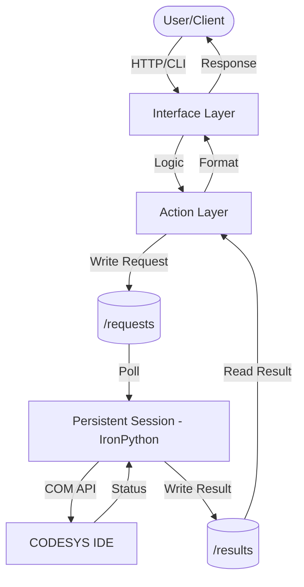

# System Architecture

The Codesys-API provides a persistent RESTful wrapper around the CODESYS automation software, enabling headless control and automation via standard web protocols.

## Execution Pipeline
Every request flows through a three-layer decoupled architecture:

1. **Interface Layer (Host/Python 3)**:
   - **CLI**: `codesys_api.cli_entry` parses user commands.
   - **REST API**: `HTTP_SERVER.py` (BaseHTTPServer) handles incoming HTTP requests.
2. **Action Layer (Host/Python 3)**:
   - Orchestrates high-level logic and state.
   - Performs environment validation via `codesys-tools doctor`.
   - Manages the `CodesysProcessManager` to ensure the IDE is running.
3. **Engine Layer (Guest/IronPython 2.7)**:
   - `PERSISTENT_SESSION.py` runs inside the CODESYS process.
   - Interacts directly with the `scriptengine` COM API.
   - Polls for requests and executes them within the IDE's main thread context.

## IPC Mechanism (Named Pipe)
Communication between Host (Python 3) and Guest (IronPython 2.7) uses a Windows named pipe:

- **Transport**: `named_pipe_transport.py` writes the script over a named pipe via `kernel32` ctypes.
- **Execution**: `PERSISTENT_SESSION.py` polls the pipe, executes the received IronPython snippet via `scriptengine`, and writes a JSON result back.
- **Synchronization**: `script_executor.py` waits for the result with a configurable timeout.
- **Pipe name**: defaults to `codesys_api_session`, overridable via `CODESYS_API_PIPE_NAME`.

The file-based transport (`requests/` / `results/` directories) was retired and is no longer supported.

## Boundary Contract (The Golden Rule)
To maintain stability, the system follows a strict "Boundary Contract":
- **Approved Primitives**: `projects.open()`, `projects.create()`, and raw snippet execution via `/api/v1/script/execute`.
- **Prohibited Primitives**: Direct opening of project templates (e.g., `Standard.project`) is rejected due to multi-threading constraints in the CODESYS IDE.
- **Validation**: New features must be proven via raw probes (`scripts/manual/`) before being integrated into the `Action Layer`.

## Key Components
- **CodesysProcessManager**: Handles lifecycle (start/stop/restart) of the CODESYS process.
- **ScriptExecutionEngine**: Generates and executes IronPython snippets.
- **ApiKeyManager**: Validates authentication tokens stored in `api_keys.json`.
- **MonitoringSystem**: Tracks CPU/Memory usage and API performance metrics.

## Component Diagram (Mermaid)

